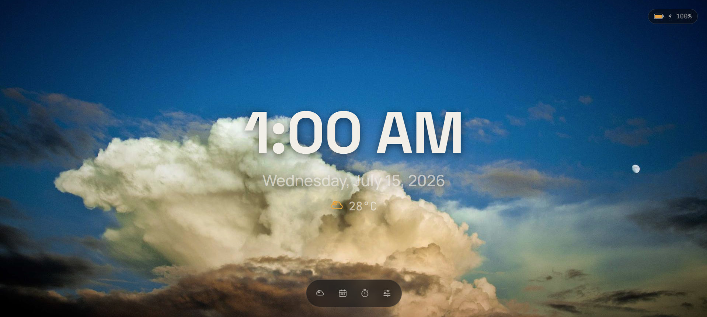
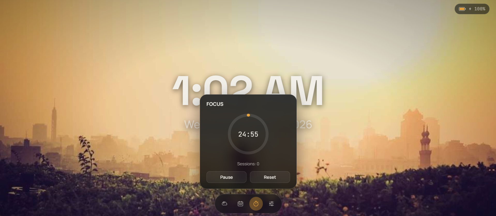

# Ani-Cal

A simple website for desktop bg and timer with docker  !!

### Tech stack 

1. html 
2. css 
3. java script 
4. json 

### Features 

1. random backgrounds every 5 sec !!
2. a clock with date !!
3. a weather forecast !!
4. a application of itself !!
5. time and date based on location !!
6. a focus timer with custom timing !!
7. a calender !! 
8. a battery indicator !!
9. 5 days forecast !!
10. custom font for clock !!

### Preview 

### Author 

elitepunith 